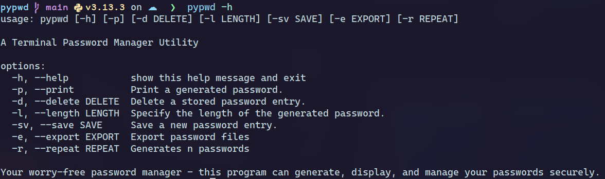
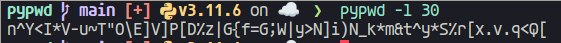

# PYPWD Program Usage Guide
(Only for UNIX systems)


The `pypwd` program is a password manager tool written in Python that allows you to generate and manage passwords. It provides a command-line interface for various password-related operations.
I it easier to install and easy to use, Don't worry where are your passwords, `pypwd` maneges all of them.

## Getting Started

Make sure you have Python 3.x installed on your system. The program consists of modules such as `Generator`, `save_pwd`, and `argparse`.

## Usage

+ -**l**, **--length**: Generate a random password of the specified length.
+ **-p**, **--print**: Print all stored passwords.
+ **-d**, **--delete**: Delete a specific password associated with an account or + company.
+ -**sv**, **--save**: Save the generated password for a user or company.
+ -**e**, **--export**: Export the file password to another directory in other format
+ -**r**, **--repeat**: Generates n the passwords and writes on the terminal  

```shell
## For create a password for the moment
## You need to write somethng like here

$ python pypwd.py [options]
```
For example, if you want to show all the commands, specify the flag ´-h´ or ´--help´.


This is anther example who creates a password and print it on terminal 

```bash
python pypwd.py --length 23 
```

<sub>Actully is not necessary specify the print ´-p´ flag because the generator raises on console the password</sub>

## Executing

For the moment you can install it using the pip command, the sintax will change
depends of your work envoriment.
In <span style="color:#0f94d2;">Arch Linux</span> you can install it using the following instructions.

```bash
sudo pacman -S python-pyspwd
```

Where `pyspwd` is the packet you want to install.
IF you don't install you can use stablished an alias or if you prefer 
you are able to write the following code in the end of you bash/fish/zsh/.. . 
For example, on fish you can write:

```shell
alias pypswd "python /$HOME/user/your_directory/pypswd/pypswd.py"
```


