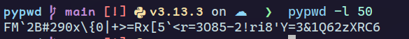

# PYPWD - Secure Password Manager 

(For UNIX systems only)

The `pypwd` program is a Python-based password manager that allows you to generate and manage passwords with ease. It offers a command-line interface to perform various password-related operations with **AES-256 encryption** for maximum security.
Installation is straightforward, and using it is simple—`pypwd` takes care of managing all your passwords securely with military-grade encryption.

##  Quick Start

```bash
# 1. Install dependencies
pip install -r requirements.txt

# 2. Setup your master password (first time only)
python pypwd.py --setup

# 3. Generate a password
python pypwd.py --length 20

# 4. Save a password
python pypwd.py --length 20 --save "Gmail"

# 5. View all passwords
python pypwd.py --print
```

That's it! Your passwords are now encrypted and secure. 

##  Security Features

- **AES-256 Encryption**: All passwords are encrypted using industry-standard AES-256 encryption (same as banks and government agencies)
- **PBKDF2 Key Derivation**: Master password is processed through PBKDF2 with 100,000 iterations for maximum security
- **Secure Salt Generation**: Unique 256-bit salt for each installation prevents rainbow table attacks
- **Master Password Protection**: All operations require your master password for security
- **Zero-Knowledge Architecture**: Your master password is NEVER stored anywhere - only in your memory
- **Military-Grade Security**: Uses the same encryption standards as KeePass, 1Password, and Bitwarden

##  Understanding the Master Password System

### What is a Master Password?

The **master password** is a single, strong password that you create to protect ALL your other passwords. Think of it as the "key to your digital vault."

#### How it works:

1. **You create ONE master password** (like "MySecurePass123!")
2. **This password encrypts ALL your stored passwords**
3. **You only need to remember this ONE password**
4. **Without it, no one can access your stored passwords** - even if they steal your password file

#### Example:

```
Your Master Password: "MySecurePass123!"

Stored Passwords (encrypted):
- Gmail: "encrypted_data_here"
- Facebook: "encrypted_data_here" 
- Bank: "encrypted_data_here"
```

###  Security Benefits:

- **If someone steals your password file** → They can't read it (no master password stored)
- **If someone hacks your computer** → They can't decrypt your passwords
- **Even you can't access passwords** → Without typing your master password
- **Zero-Knowledge Architecture** → Your master password is NEVER saved anywhere

###  How Encryption Works:

1. **You type your master password** → PYPWD uses it to create an encryption key
2. **Your passwords get encrypted** → Using AES-256 encryption
3. **Only encrypted data is saved** → To your password file
4. **Master password is forgotten** → Not stored anywhere
5. **Next time you use PYPWD** → You must type your master password again

## Getting Started

Ensure you have Python 3.x installed on your system. The program includes modules such as `Generator`, `save_pwd`, `encryption`, and `argparse`.

### First Time Setup

**Step 1: Setup your master password**

```bash
python pypwd.py --setup
```

This will prompt you to create a master password that will encrypt all your stored passwords.

**Step 2: Start using PYPWD**

```bash
# Generate a password
python pypwd.py --length 20

# Save a password
python pypwd.py --length 20 --save "Gmail"

# View all passwords
python pypwd.py --print
```

**Important:** Your master password is never stored anywhere - you must remember it! If you forget it, you'll need to start over with `--setup`.

##  Troubleshooting

### "Password file not found" Error

``` Password file not found. This appears to be your first time using PYPWD!
Please run: python pypwd.py --setup
```

**Solution:** Run the setup command to create your encrypted password vault.

### "Wrong master password" Error

```
**[X]** Wrong master password! Please try again.
If you forgot your master password, you'll need to start over.
Run: python pypwd.py --setup (this will reset all passwords)
```

**Solution:**

- Try typing your master password again (check for typos)
- If you forgot it, run `python pypwd.py --setup` to start over (This will delete all stored passwords!)

### "Master password must be at least 8 characters long"

**Solution:** Choose a stronger master password with at least 8 characters.

### "Passwords don't match"

**Solution:** Make sure you type the same password in both fields during setup.

##  Advanced Usage

### Changing Your Master Password

Currently, PYPWD doesn't support changing master passwords. If you need to change it:

1. Export your passwords: `python pypwd.py --export backup.json`
2. Reset: `python pypwd.py --setup` (this deletes all passwords)
3. Re-import your passwords manually

### Backup and Recovery

```bash
# Export all passwords to a file
python pypwd.py --export my_passwords.json

# This creates a backup of your encrypted passwords
# Keep this file safe - you'll need your master password to decrypt it
```

### Security Best Practices

1. **Choose a strong master password** (at least 12 characters, mix of letters, numbers, symbols)
2. **Never share your master password** with anyone
3. **Backup your password file** regularly
4. **Use a different master password** than your other accounts
5. **Consider using a password manager** to remember your master password (ironic, but secure!)

##  Technical Details

### Encryption Algorithm

- **Cipher**: AES-256 (Advanced Encryption Standard with 256-bit keys)
- **Mode**: CBC (Cipher Block Chaining) with random IV
- **Key Derivation**: PBKDF2-HMAC-SHA256 with 100,000 iterations
- **Salt**: 256-bit random salt (unique per installation)
- **Padding**: PKCS7 padding for block alignment

### File Structure

```
~/.local/pypswd/
├── secrets.bin          # Encrypted password database
└── .salt               # 256-bit salt file (restricted permissions)
```

### Security Model

- **Zero-Knowledge**: Master password never stored
- **Forward Secrecy**: Each password encrypted independently
- **Salt Protection**: Prevents rainbow table attacks
- **Key Stretching**: PBKDF2 makes brute force attacks computationally expensive
- **File Permissions**: Salt file has 600 permissions (owner read/write only)

### Comparison with Other Password Managers


| Feature       | PYPWD | KeePass | 1Password | Bitwarden |
| --------------- | ------- | --------- | ----------- | ----------- |
| AES-256       | ✅    | ✅      | ✅        | ✅        |
| PBKDF2        | ✅    | ✅      | ✅        | ✅        |
| Local Storage | ✅    | ✅      | ❌        | ❌        |
| Open Source   | ✅    | ✅      | ❌        | ✅        |
| CLI Interface | ✅    | ❌      | ❌        | ❌        |

##  Why Choose PYPWD?

###  **Advantages**

- **100% Local**: Your passwords never leave your computer
- **Open Source**: Full transparency - you can audit the code
- **Lightweight**: Minimal dependencies, fast performance
- **CLI-First**: Perfect for developers and terminal users
- **Secure**: Military-grade encryption (AES-256 + PBKDF2)
- **Simple**: Easy to use, no complex GUI
- **Portable**: Works on any UNIX system

###  **Perfect For**

- **Developers** who prefer command-line tools
- **Privacy-conscious users** who want local storage
- **System administrators** managing multiple accounts
- **Anyone** who wants a simple, secure password manager

###  **Security Guarantee**

PYPWD uses the same encryption standards as:

- **Banks** (AES-256)
- **Government agencies** (PBKDF2)
- **Professional password managers** (KeePass, 1Password)

Your passwords are as secure as your master password. Choose wisely! 🛡️

## Usage

- **-l**, **--length**: Generate a random password of the specified length.
- **-p**, **--print**: Display all stored passwords.
- **-d**, **--delete**: Delete a specific password associated with an account or company.
- **-sv**, **--save**: Save the generated password for a user or company.
- **-e**, **--export**: Export the passwords to another directory in a different format (json, xml, yaml, txt).
- **-r**, **--repeat**: Generate multiple passwords and display them in the terminal.

```shell
# To generate a password instantly
# Use a command like this:

$ python pypwd.py [options]
```

For example, to display all available commands, use the `-h` or `--help` flag.


Here is another example that generates a password and prints it in the terminal:

```bash
python pypwd.py --length 23 
```


<sub>Note: It's not necessary to specify the `-p` flag because the password will be displayed in the terminal by default after generation.</sub>

## Installation

For now, you can install it using the `pip` command. The syntax may vary depending on your environment.

On <span style="color:#0f94d2;">Arch Linux</span>, you can install it using the following command:

```bash
sudo pacman -S python-pyspwd
```

Where `pyspwd` is the package to be installed.
If you choose not to install it globally, you can set an alias or add the following to the end of your shell configuration file (e.g., `.bashrc`, `.zshrc`, or `.config/fish/config.fish`).
For instance, in Fish, you can write:

```shell
alias pypswd="python $HOME/user/your_directory/pypswd/pypswd.py"
```


